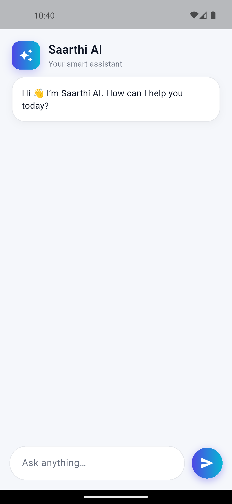
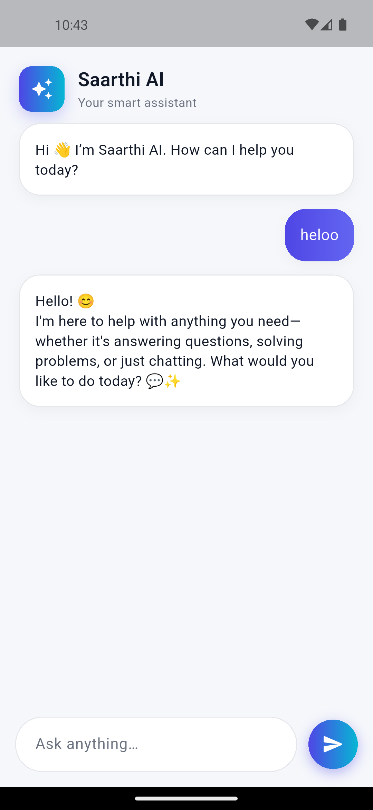
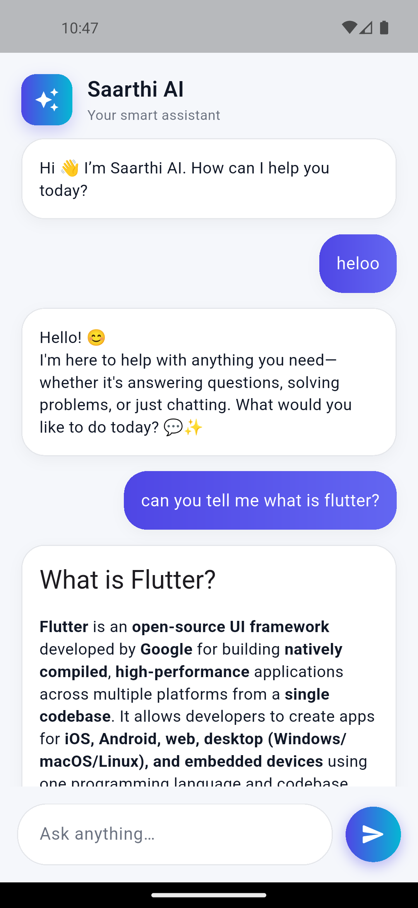

# Saarthi AI – Flutter Chat Application 🤖💬

A modern **AI-powered chat application built with Flutter** that allows users to interact with an AI assistant in a clean and responsive interface. The app connects to an AI model via API and displays responses with markdown formatting.

---

## 🚀 Features

* 🤖 AI powered chatbot
* 💬 Real-time messaging interface
* 🎨 Clean and modern UI design
* 📱 Fully responsive chat layout
* 🧠 Markdown rendering for AI responses
* ⚡ Smooth scrolling chat experience
* ⏳ Typing indicator while AI responds

---

## 🛠️ Tech Stack

* **Flutter**
* **Dart**
* **HTTP Package**
* **OpenRouter API**
* **DeepSeek AI Model**
* **GPT Markdown Renderer**

---

## 📱 App Screenshots

<p align="center">
  
  &nbsp;&nbsp;&nbsp;&nbsp;&nbsp;&nbsp;
  
</p>

<p align="center">
  
  &nbsp;&nbsp;&nbsp;&nbsp;&nbsp;&nbsp;
  
</p>

---

## 📂 Project Structure

```
lib
│
├── main.dart
├── home_screen.dart
└── message.dart
```

**main.dart**

* Entry point of the Flutter application.

**home_screen.dart**

* Contains the chat UI and AI communication logic.

**message.dart**

* Data model for storing chat messages.

---

## ⚙️ Installation

1️⃣ Clone the repository

```
git clone https://github.com/silentboy-07/Flutter_Chat_App.git
```

2️⃣ Navigate to project folder

```
cd Flutter_Chat_App
```

3️⃣ Install dependencies

```
flutter pub get
```

4️⃣ Run the app

```
flutter run
```

---

## 🔑 API Configuration

This project uses an **AI API from OpenRouter**.

Before running the app, replace the API key inside:

```
home_screen.dart
```

Example:

```dart
static const _apiKey = "YOUR_API_KEY";
```

---

## 🎯 Future Improvements

* 🎙️ Voice input support
* 💾 Chat history storage
* 🌙 Dark / Light mode toggle
* 🤖 Multiple AI model support
* 📤 Share chat responses

---

## 👨‍💻 Author

**Vikas Singh**

---

⭐ If you like this project, consider giving it a **star** on GitHub!
